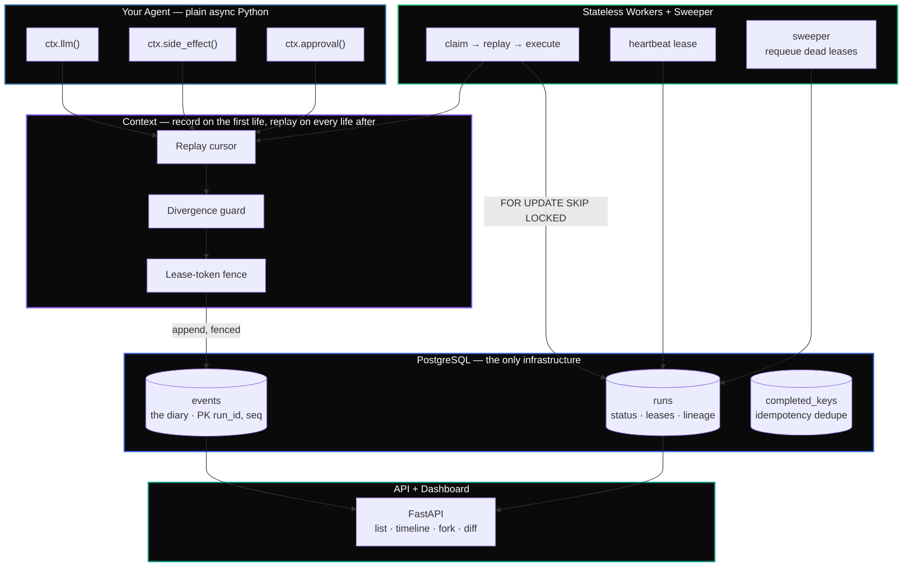

<div align="center">

# Timefork

**A durable execution runtime for AI agents — built on nothing but Postgres.**

[](https://www.python.org/)
[](https://www.postgresql.org/)
[](https://www.psycopg.org/)
[](https://fastapi.tiangolo.com/)
[](#results--proof)
[](LICENSE)

[Features](#features) · [Architecture](#architecture) · [Results](#results--proof) · [Quick Start](#quick-start) · [Reference](#reference) · [Design Notes](#design-notes)

</div>

---

## About

An AI agent is a long-running loop — it calls a model, calls a tool, calls the model again, holding state in memory for seconds or minutes. **Then the process dies:** a deploy restarts the box, the OOM killer fires, a worker hangs and someone reaches for `kill -9`. Restart naively and you re-pay for every model call — and worse, you might send the same email or issue the same refund twice.

**Timefork makes the agent durable.** Every step is written to an append-only log in Postgres, so a crash is just a pause: the agent resumes exactly where it stopped, side effects fire exactly once, a fleet of workers tolerates death, and — the headline — any run can be **rewound to step _k_, patched, and forked into a new timeline** without re-paying for the steps before _k_.

**Postgres is the only infrastructure.** No Kafka, no Redis, no Temporal cluster. The event log, the task queue (`FOR UPDATE SKIP LOCKED`), the lease store, and the dedupe store are all one database — a deliberate design stance, not a shortcut.

---

## Features

| Feature | Description |
|:--------|:------------|
| **Crash-proof resume** | Every step is an append-only event; after a crash the agent replays the log — reading recorded answers back instead of re-calling the model — and continues from where it stopped, for free. |
| **Exactly-once side effects** | A side effect that writes to Postgres (a refund, a ledger entry) fires exactly once, even under `kill -9` at the worst instant — the effect, its idempotency key, and the completion event commit in one transaction. External APIs forward that key to dedupe ([honest scope](#honest-scope)). |
| **Fault-tolerant worker fleet** | Stateless workers claim jobs from a Postgres queue; a dead worker's job is swept back and resumed; a revived "zombie" worker's stale writes are rejected by the database. |
| **Time-travel debugging** | Rewind a run to step _k_, patch the prompt/config, and fork a new timeline — the prefix is copied for free. A side-by-side **diff** shows the shared prefix and the exact divergence point. |
| **Durable human approval** | An agent can pause at a human gate ("approve this $200 refund?"). The pause survives a crash; a human approves out-of-band and a fresh process resumes past the gate. |
| **Loud failure, never silent** | If the agent's code changes under replay, a divergence detector fails with a diff instead of returning a stale answer — at both the model call *and* the approval gate. |

---

## Architecture



### Request Flow

```
┌──────────┐     ┌───────────────┐     ┌──────────────┐     ┌───────────────┐
│  Agent    │────▶│  Context       │────▶│  Replay or   │────▶│  Postgres     │
│  step     │     │  (ctx.*)       │     │  execute     │     │  append+commit│
└──────────┘     └───────────────┘     └──────────────┘     └───────────────┘
                        │                       │
                  ┌─────▼──────┐         ┌──────▼───────┐
                  │ Divergence │         │ Fence check  │
                  │ guard      │         │ (lease token)│
                  └────────────┘         └──────────────┘
```

### The data model — four tables carry everything

| Table | What it holds |
|:------|:--------------|
| `events` | The diary. Every step, in order. `PRIMARY KEY (run_id, seq)` makes a duplicate or out-of-order write impossible. |
| `runs` | One row per run: its status, the worker lease (`lease_owner`, `lease_expiry`, `lease_token`), and fork lineage (`parent_run_id`, `fork_seq`). |
| `completed_keys` | The dedupe store. One idempotency key per side effect, with its result — this is what makes "exactly once" exact. |
| *(no fourth broker)* | The task queue **is** the `runs` table — a row's status (`queued` / `running` / `paused` / `completed` / `failed`) is its queue state. |

---

## How It Works

Your agent is plain async Python. The only rule: every bit of non-determinism — the model, tools, time, randomness — goes through `ctx`. That's what makes replay possible.

```python
async def refund_agent(ctx, order):
    # Recorded the first time, replayed (for free) on every life after.
    decision = await ctx.llm(f"Should we refund order {order['id']}? Reason: {order['reason']}")

    # A durable pause. The process may die here; the question is already in the diary.
    if not await ctx.approval(f"Refund ${order['amount']} for order {order['id']}?"):
        return "denied"

    # Fires exactly once, even under kill -9 at any instant.
    await ctx.side_effect(lambda conn: issue_refund(conn, order["id"], order["amount"]))
    return "refunded"
```

- **Record/replay** — on the first life, `ctx.llm()` records an `LLM_CALLED` event; on the next life a cursor walks the log, position _i_ mapping to event _i_, and returns the recorded answer without touching the model. When the cursor passes the end of the log, the agent is "caught up" and does real work again.
- **Exactly-once** — a side effect is two phases: record a `TOOL_INTENT` and commit, then in **one transaction** run the effect, insert its idempotency key into `completed_keys`, and append `TOOL_COMPLETED`. Crash before the commit → the key is absent, so it runs on resume. Crash after → the key is present, so it's skipped.
- **Fencing** — each claim bumps a monotonic `lease_token`; the worker stamps every write with it, and the fenced insert locks the `runs` row and rechecks the token in the same transaction, so a reclaimed run rejects a zombie's write with `StaleFenceError`. The correctness lives in the SQL, not in a Python `if`.

---

## Results & Proof

Every guarantee is backed by a test or a reproducible `kill -9` certificate. These are **real captured runs**, not mock-ups.

**The full suite — 37 tests against a live Postgres:**

```text
$ python -m pytest -q
37 passed in 4.47s
```

**Resume under crash** — a 15-step agent killed at random points 100 times:

```text
$ python harness/chaos.py 100
chaos certificate: 100/100 runs completed, every one with exactly 15 LLM
events identical to the never-crashed baseline, after 173 random SIGKILLs.
```

**Exactly-once side effects** — 1,000 refund runs, each killed at a random point:

```text
$ python harness/refund_chaos.py 1000
exactly-once certificate: 1000/1000 runs completed, all 3000 counters
exactly 1, after 670 random SIGKILLs.
```

**Zombie fencing** — a frozen worker is reclaimed, then thawed; its stale writes are rejected:

```text
$ python harness/fleet.py zombie
zombie: A held token 1, B reclaimed with token 2
  counters after B finished: [1, 1, 1]
  counters after thawing A:  [1, 1, 1]
  events written with A's stale token after the thaw: 0
  -> zombie fenced out, appended nothing, counters stayed exactly 1
```

**Fault-tolerant fleet** — random workers `SIGKILL`ed mid-job until the queue drains:

```text
$ python harness/fleet.py chaos
chaos: 40 jobs, 4 workers, 6 random SIGKILLs -> ALL completed, every counter exactly 1
```

**The durable approval showcase** — consult a model, pause for a human, resume in a fresh process, refund once:

```text
$ python examples/13_showcase.py
brain: mock brain (set ANTHROPIC_API_KEY for the real model)

life 1 -- consult the model, then reach the approval gate:
  PAUSED. the diary durably holds the request:
    Recommend approving: the customer reports 'item arrived damaged', and
    $49.99 is within the standard refund window.  Approve refund of $49.99?
  (the process could die now and lose nothing.)

a human reviews and approves (out of band -- `timefork approve RUN`):
  APPROVAL recorded.

life 2 -- a FRESH process resumes from the diary:
  approved=True, refund paid 1 time(s), bill=1 model call(s)
  diary: ['LLM_CALLED', 'APPROVAL_REQUESTED', 'APPROVAL', 'TOOL_INTENT', 'TOOL_COMPLETED']
  -> the model was consulted once; resume replayed it for free; the refund fired exactly once.
```

### Benchmarks

Numbers are **indicative** (mock LLM at fixed latencies, Postgres 16 on a laptop) and **reproducible** via `python bench/benchmarks.py`. They measure the machinery, not network or real-model variance.

```text
$ python bench/benchmarks.py
per-step latency, ms (p50 / p95 / p99):
  no durability:   0.006 / 0.006 / 0.012
  durable (diary): 1.112 / 1.728 / 5.608
  overhead/step (p50): 1.106 ms

recovery time for a 50-step run, ms (p50 / p95 / p99):
  0.49 / 0.87 / 0.96   (~102,890 events/sec replayed)

fork vs rerun (40-step run, forked at step 39):
  rerun from scratch:   974.5 ms, 40 model calls
  fork + finish:         30.9 ms,  1 model calls
  -> 32x faster, 39 model calls saved
```

| Metric | Result |
|:-------|:-------|
| Per-step durability overhead | **~1.1 ms** (one commit) |
| Recover a 50-step run (replay) | **0.49 / 0.87 / 0.96 ms** p50/p95/p99 |
| Fork vs. rerun | **39 model calls saved** (32× faster at a simulated 20 ms/step) |

> The invariant, dollar-meaningful number is **39 model calls saved** — the wall-clock multiplier scales with real model latency (500×+ at seconds/step).

---

## Quick Start

### Prerequisites

- **Docker** (Colima works on macOS) and **Python 3.11+**

### 1. Start Postgres

```bash
docker compose up -d --wait          # Postgres 16, schema auto-applies, published on :5433
```

### 2. Install

```bash
python3.11 -m venv .venv
source .venv/bin/activate
pip install -e ".[dev]"
```

### 3. Prove it works

```bash
python -m pytest                     # 37 tests, ~5s, against the real Postgres
```

### 4. Watch it work

```bash
python examples/03_record_and_replay.py   # a crashed run resumes for free
python examples/11_fork.py                # fork at step 3: 5 model calls become 2
python examples/13_showcase.py            # the durable approval showcase
```

### 5. Run the crash certificates

```bash
python harness/chaos.py 100          # resume: 100/100 complete, exactly 15 events each
python harness/refund_chaos.py 1000  # exactly-once: 1,000 runs, all counters = 1
python harness/fleet.py chaos        # fleet: random worker kills, every counter = 1
python harness/fleet.py zombie       # fencing: a thawed zombie's writes are rejected
```

### 6. The dashboard (optional)

```bash
uvicorn timefork.dashboard:app --port 8000   # open http://localhost:8000
```

> The dashboard is a **local, unauthenticated** debugging view — list runs, browse a timeline, fork, and diff. Don't expose it to a network.

The real-model showcase runs on a **mock brain by default** (so anyone can reproduce it with no key). To use the real Claude model: `pip install -e ".[showcase]"`, put `ANTHROPIC_API_KEY=...` in a local `.env`, and re-run `examples/13_showcase.py`.

---

## Project Structure

```
timefork/
├── timefork/                  # the engine
│   ├── events.py              # the diary: append-only log, fenced writes
│   ├── context.py             # record/replay, exactly-once, approval gate
│   ├── mock_llm.py            # deterministic mock model (all tests use this)
│   ├── llm.py                 # the real Claude client (showcase only)
│   ├── queue.py               # Postgres task queue: claim, heartbeat, sweep
│   ├── worker.py              # claim → replay → execute, fenced
│   ├── fork.py                # rewind + copy prefix + patch = a new timeline
│   ├── diff.py                # side-by-side timeline diff
│   ├── crash.py               # kill -9 injection at named points
│   ├── cli.py                 # timefork ls / show / fork / diff / approve
│   └── dashboard.py           # thin FastAPI dashboard
│
├── tests/                     # 37 tests, incl. in-process SIGKILL crash injection
├── harness/                   # the kill -9 certificates (chaos, refund, fleet)
├── examples/                  # 13 narrated, runnable demos (01..13)
├── bench/                     # reproducible benchmarks
├── db/                        # schema.sql + numbered migrations
└── docker-compose.yml         # Postgres 16
```

---

## Reference

### The `Context` SDK

An agent reaches the outside world only through `ctx`:

| Call | Records | Guarantee |
|:-----|:--------|:----------|
| `await ctx.llm(prompt)` | `LLM_CALLED` | Recorded once; replayed free on every later life (the model is never called twice). |
| `await ctx.side_effect(fn)` | `TOOL_INTENT` + `TOOL_COMPLETED` | The effect runs **exactly once** across any crash sequence. |
| `await ctx.approval(question)` | `APPROVAL_REQUESTED` + `APPROVAL` | Pauses durably for a human; replays the decision, divergence-checked. |
| `ctx.config(key, default)` | — | Reads config as patched by any fork up to this point. |

### CLI

| Command | Description |
|:--------|:------------|
| `timefork ls` | List recent runs with status and lineage |
| `timefork show RUN` | A run's events + parent/forks |
| `timefork fork RUN --at K [--set k=v]` | Rewind to step _K_, patch, and branch a new timeline |
| `timefork diff RUN_A RUN_B` | Side-by-side: shared prefix + first divergence |
| `timefork approve RUN [--no]` | Sign off (or deny) a run paused at a human gate |

### Dashboard routes (FastAPI)

| Method | Route | Description |
|:-------|:------|:------------|
| `GET` | `/` | Run list with status and lineage |
| `GET` | `/run/{id}` | Timeline, lineage, and a fork form |
| `POST` | `/run/{id}/fork` | Fork the run (rejects invalid fork points) |
| `GET` | `/diff/{a}/{b}` | Side-by-side timeline diff |

### Event types (the diary vocabulary)

| Event | Meaning |
|:------|:--------|
| `LLM_CALLED` | A model call, with its prompt and response |
| `TOOL_INTENT` / `TOOL_COMPLETED` | The two phases of an exactly-once side effect |
| `APPROVAL_REQUESTED` / `APPROVAL` | A human gate: the question, then the yes/no decision |
| `PATCH_APPLIED` | A fork's patch (new prompt/config), injected at the fork point |

---

## Tech Stack

| Layer | Technology |
|:------|:-----------|
| Language | Python 3.11+ (async) |
| Database | PostgreSQL 16 — event log, queue, lease store, and dedupe store, all in one |
| DB driver | psycopg 3 — raw SQL, no ORM (by design) |
| API / Dashboard | FastAPI (server-rendered HTML, no JS) |
| Tests | pytest — 37 tests, incl. subprocess `SIGKILL` crash injection |
| Real model (optional) | Anthropic SDK — the showcase only |

---

## Design Notes

The interesting parts are the tradeoffs, and where the choices differ from the incumbents.

1. **Postgres-only, on purpose.** Temporal runs a dedicated cluster; many setups add Kafka or Redis. Timefork makes Postgres carry every role. The cost is a throughput ceiling at very large scale. The win: the whole system is one `docker compose up`, every invariant is a constraint you can inspect, and because a side effect and its idempotency key commit in the *same transaction*, exactly-once needs no external coordinator. (DBOS made this same Postgres-only bet — good company to be in.)

2. **The diary is exposed and forkable.** Durable-execution engines treat history as an internal detail. Timefork makes it a first-class, queryable, **forkable** object — that's what makes rewind/patch/branch/diff possible. LangGraph has checkpoint rewind; Timefork's angle is the event-log-level fork with a zero-cost prefix, a CLI + diff, and an explicit honesty rule: *a fork is a fresh experiment, not a counterfactual proof of what the original would have done.*

3. **Loud failure over silent corruption.** Replay matches recorded answers to calls by position — fragile if the code changes underneath. Rather than return a stale answer, the divergence detector raises with a diff, at both the model call and the approval gate. A run that stops with a clear error is recoverable; one that silently returns the wrong answer is a debugging nightmare you may never notice.

### Honest scope

- **Exactly-once** holds for effects that commit **on the same Postgres transaction** (the counters the certificates exercise). For an external API (Stripe, SMTP), the idempotency key is the handle you forward so the *receiver* dedupes; without an idempotent receiver, intent/completion gives at-least-once — the standard limit, stated plainly.
- This is a **single-node** runtime for minutes-long agent workloads, not a millions-per-second sharded service. Per-event commits and polling workers are deliberate simplicity, not production tuning.

---

## Contributing

1. Fork the repository
2. Create your feature branch → `git checkout -b feat/amazing-feature`
3. Commit your changes → `git commit -m "feat: add amazing feature"`
4. Push to the branch → `git push origin feat/amazing-feature`
5. Open a Pull Request

The full 5-week build plan, with every concept in order, is in [`ROADMAP.md`](ROADMAP.md).

---

## License

Released under the MIT License. See [LICENSE](LICENSE) for details.

---

<div align="center">

**[↑ Back to Top](#timefork)**

</div>
